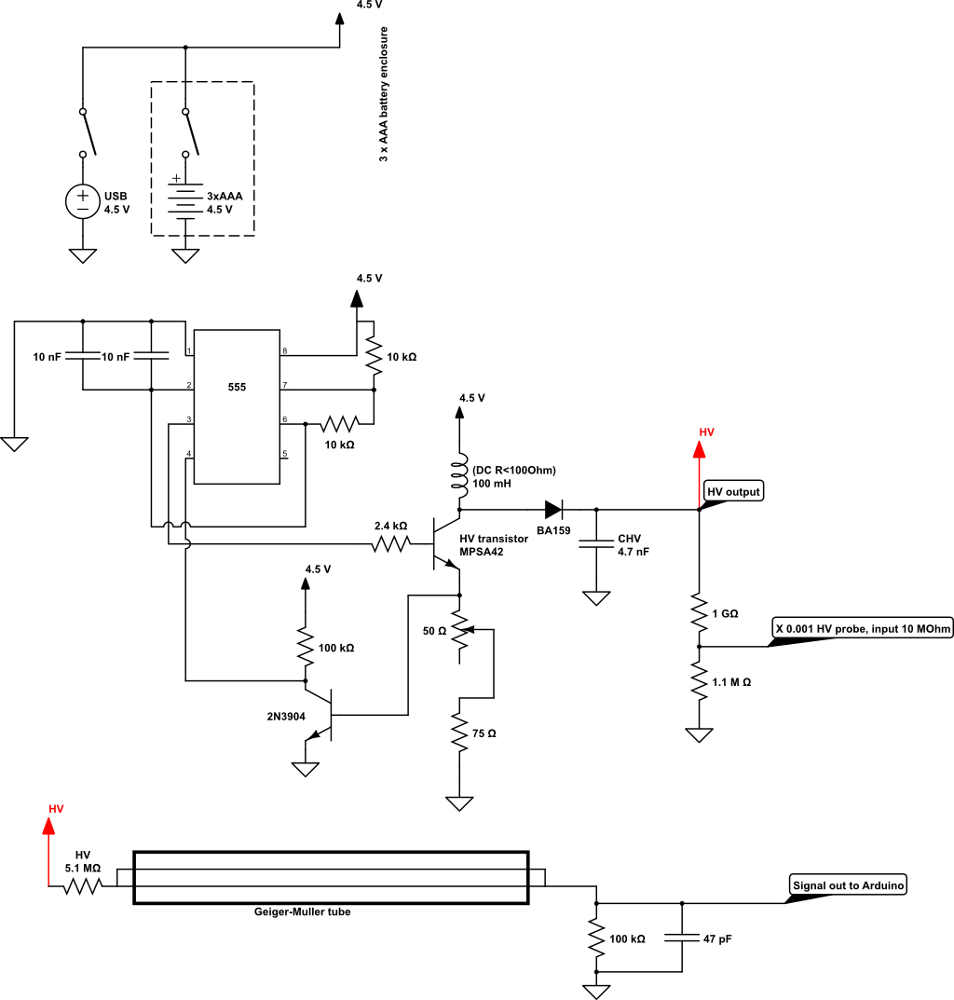
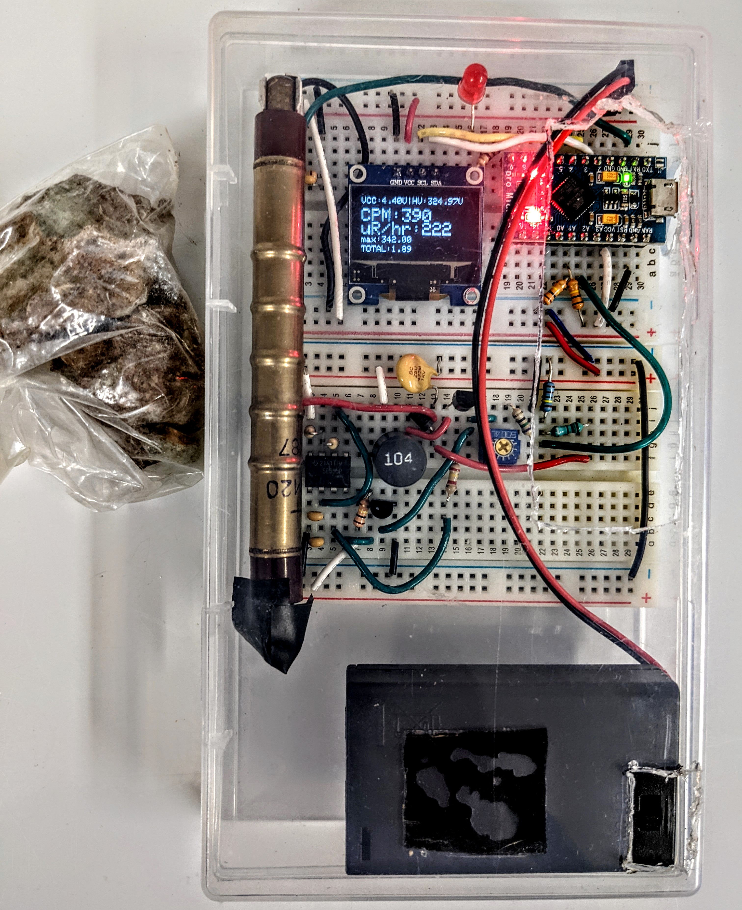

# Geiger_lanph: a simple Geiger counter design

Author:  Areg Danagoulian

This repository provides documentation for a very simple design of a Geiger Counter.  It is based on a synthesis of various open source Geiger counter
designs, and is optimized for simplicity rather than ergonomics. 
The design consists of on an analog design for a high voltage (HV) module, a very minimalist analog signal processing configuration, followed up by Arduino DAQ instrumentation.

While there are many designs for Geiger counters out there, this design is based on the following objectives:

* Simplicity.  No/minimal soldering. Built from fairly common electronic and hardware components
* Easy to hack, easy to make quick changes.  The use of the breadboard was chosen with this in mind
* Low price.  If the components are purchased in bulk the total unit cost is approx. \$52 -- this includes the Arduino, LCD, and the Geiger tube. 
* The design is not meant to be a product. It is not meant to be pretty. It is instead meant to be an educational platform to help students learn about
  + nuclear detection, e.g. by performing experiments with various radioactive sources
  + statistics, e.g. by collecting data and observing various nuances of Poisson processes
  + the basics of analog design
  + the basics of Arduino-based digital and software design

The design can be split into three main parts: HV module; Radiation sensor; DAQ and Readout.

**HV module**

The HV module takes the 4.5 V from a battery pack (or 5V from USB interface) and boost converts it to ~300V.  
This is achieved by using a 555 timer as a switching device in feedback mode.  The "core" of the HV is an inductor coupled
to a capacitor through a rectifier diode.  To achieve the HV the inductor-ground connection is "switched" on and off via a HV transistor,
which takes the switching input from the 555 into its base.  This is the basic principle of how spark plugs on an internal combustion 
engine work. 

**Radiation Sensor**

The HV is then used to bias the Geiger-Muller tube, which in our case is the classic Soviet SBM-20 ($20 on ebay) via a 5.1 MOhm input resistor.
The negative terminal of the tube is sent to ground via a 5.1 kOhm resistor.  The readout of the signal is directly from the negative terminal.  

The diagram representing the analog part of the design can be seen below.



**Data Acquisition (DAQ)**

The DAQ is based on a small Arduino micro-controller.  It takes the output directly from the Geiger tube into one of its digital pins.  
The digital input requires a TTL signal, and while the output of the Geiger tube is not exactly TTL it's close enough to achieve reliable
triggering.  The Arduino sketch can be found on one of our other repositories [here](https://github.com/ustajan/GeigerDAQ/tree/main/GeigerCounter).

For any DAQ system the key question is ask is -- what is the dead time?  We estimate that the dead time for the DAQ configuration employed in this
design is <1ms. 

The DAQ performs the following actions:

* estimates the count rate via a variable integration window and displays it on a 16x2 standard LCD.  The integration time is determined as following:
  + When the observed rate is <20 CPM the integration time is 30 sec
  + else, if its <100 CPM the integration time is 10 sec
  + else: 1 second
* In addition to the count rate the DAQ also displays the dose rate in uR/hr.  A few points:  
  + The conversion coefficient for SBM-20 is 0.57 (uR/hr)/CPM.
  + Note that this conversion is based on 137Cs standard, i.e. 662 keV.  This conversion may be completely inaccurate for lower energy sources.  To "flatten" the energy dependence the tube can be wrapped in ~mm of lead as a way of achieving what's known as energy compensation.

**Readout to computer via the serial connection**

In addition to analyzing the count and dose rates and displaying those on the LCD, the Arduino DAQ software can also "talk" to a computer via the serial bus.
The software for this can be found in the above mentioned repository [here](https://github.com/ustajan/GeigerDAQ) -- look for ```logger.py``` python code.
The code reads and prints to file the timestamp of every event in microseconds, allowing for subsequent detailed statistical analysis.

**Files and documentation**

+ ```./BOM``` -- the bill of materials spreadsheet
+ ```./instructions``` -- Assembly instructions -- **TBA**
+ Schematic -- above
+ Educational material and problem sets / assignments -- **TBA**

**Pictures, pictures, pictures...**




**To Do**

Future goals:

+ Change the Arduino code to include readout of the HV voltage as well as the battery voltage.  Include a warning if below a threshold