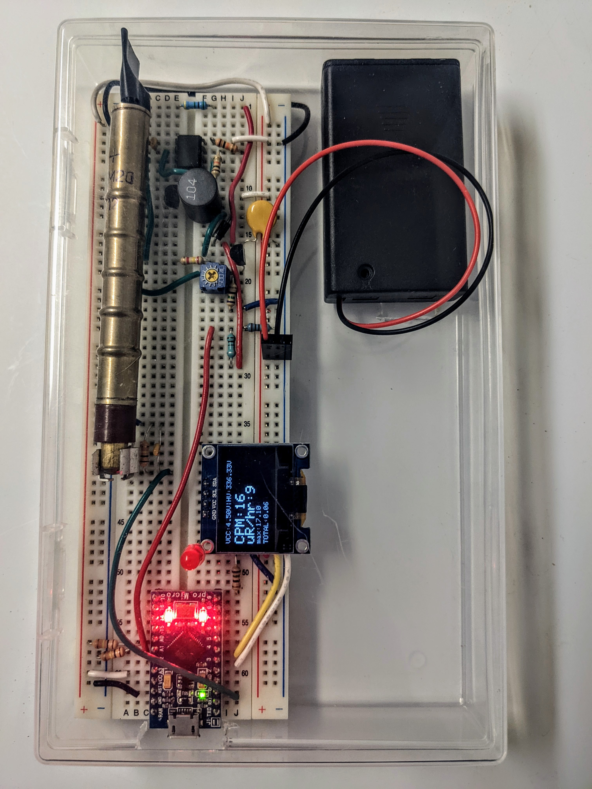

# Geiger_lanph: a simple Geiger counter design

Author:  [Areg Danagoulian](areg.mit.edu)

License and copyright:  see LICENSE and COPYRIGHT

This repository provides documentation for a very simple design of a Geiger Counter.  It is based on a synthesis of various open source Geiger counter
designs, and is optimized for simplicity rather than ergonomics. 
The design consists of on an analog design for a high voltage (HV) module, a very minimalist analog signal processing configuration, followed up by Arduino DAQ instrumentation.

While there are many designs for Geiger counters out there, this design is based on the following objectives:

* Simplicity.  No/minimal soldering. Built from fairly common electronic and hardware components
* Easy to hack, easy to make quick changes.  The use of the breadboard was chosen with this in mind
* Low price.  If the components are purchased in bulk the total unit cost is approx. \$40 -- this includes the \$9 Arduino, the \$5 OLED, and the $15 Geiger tube. 
* The design is not meant to be a product. It is not meant to be pretty. It is instead meant to be an educational platform to help students learn about
  + nuclear detection, e.g. by performing experiments with various radioactive sources
  + statistics, e.g. by collecting data and observing various nuances of Poisson processes
  + the basics of analog design
  + the basics of Arduino-based digital and software design


The diagram representing the analog part of the design can be seen below.


The design can be split into three main parts: HV module; Radiation sensor; DAQ and Readout.  For a detailed description see the directory *Instructions*.

**HV module**

The HV module takes the 4.5 V from a battery pack (or 5V from USB interface) and boost converts it to ~300V.  
This is achieved by using a 555 timer as a switching device in feedback mode.  The "core" of the HV is an inductor coupled
to a capacitor through a rectifier diode.  To achieve the HV the inductor-ground connection is "switched" on and off via a HV transistor,
which takes the switching input from the 555 into its base.  This is the basic principle of how spark plugs on an internal combustion 
engine work. 


***Explanation of the HV module***

The key part of the Geiger design is the boost converter which is at the core of the HV module.  It's a standard boost converter working in Discontinous Conduction Mode (DCM). This is the mode where the current in the inductor is highly discontinuous, which can be problematic in case of a large current draw at the output.  However the current draw in this design is about O(300 nanoAmps), thus DCM works very well. 

The *idealized* voltage equation for this mode can be written (see [here](https://youtu.be/6RuPplUim4E) for a full derivation) as 

Vo = (Vi / 2)(1+ sqrt(1 + 2 D^2 TR/L))

where Vo and Vi are the output and input voltages, respectively, D is the duty factor, T is the period of the switching device, R is the load on Vo, and L is the inductance.  For the values that are typical or similar to our design this can be simplified to

Vo = (D Vi / 2) sqrt(2TR/L)

What do we see?  As you increase the period T the inductor has more time to charge, thus producing a stronger voltage when the transisor shuts it off (via Ldi/dt).  It may be tempting to think that one can increase T indefinitely.  This is of course not true, because the equation above assumes *linearity* :  for T~L/R you saturate the inductor and have a non-linear exponential rise in current.  The equation above is only for T<<L/R, where L/R is the time constant of the charge-up of the inductor (fun problem to work on:  derive the equation above without relying on T<<L/R).

The HV is using the simplest form of a DC-DC boost converter which simply takes a switching input to the HV transistor as a way of stepping up 4.5 V to 300+ V.  The standard design however has a significant weakness:  if the input voltage sags so will the output voltage, as can be seen by the equation above.  The design we use instead has a feedback, which allows to reset the 555 and thus limit D:  as the voltage sags the point at which this happens gets extended, thus causing D to increase and (hopefully) counter-act the drop in Vi.  That's the idea anyway.  For this to work the design needs to be optimized to achieve the highest possible HV value, with the trim resistor then used to _reduce_ it.  This way the voltage will be limitted by the feedback, and the above described condition will be met.

**Radiation Sensor**

The HV is then used to bias the Geiger-Muller tube, which in our case is the classic Soviet SBM-20 ($20 on ebay) via a 5.1 MOhm input resistor.
The negative terminal of the tube is sent to ground via a 5.1 kOhm resistor.  The readout of the signal is directly from the negative terminal.  


**Data Acquisition (DAQ)**

The DAQ is based on a small Arduino micro-controller.  It takes the output directly from the Geiger tube into one of its digital pins.  
The digital input requires a TTL signal, and while the output of the Geiger tube is not exactly TTL it's close enough to achieve reliable
triggering.  The Arduino sketch can be found on one of our other repositories [here](https://github.com/ustajan/GeigerDAQ/tree/main/GeigerCounter).

For any DAQ system the key question is ask is -- what is the dead time?  We estimate that the dead time for the DAQ configuration employed in this
design is <1ms. 

The DAQ performs the following actions:

* estimates the count rate via a variable integration window and displays it on a 16x2 standard LCD.  The integration time is determined as following:
  + When the observed rate is <20 CPM the integration time is 30 sec
  + else, if its <100 CPM the integration time is 10 sec
  + else: 1 second
* In addition to the count rate the DAQ also displays the dose rate in uR/hr.  A few points:  
  + The conversion coefficient for SBM-20 is 0.57 (uR/hr)/CPM.
  + Note that this conversion is based on 137Cs standard, i.e. 662 keV.  This conversion may be completely inaccurate for lower energy sources.  To "flatten" the energy dependence the tube can be wrapped in ~mm of lead as a way of achieving what's known as energy compensation.

**Readout to computer via the serial connection**

In addition to analyzing the count and dose rates and displaying those on the LCD, the Arduino DAQ software can also "talk" to a computer via the serial bus.
The software for this can be found in the above mentioned repository [here](https://github.com/ustajan/GeigerDAQ) -- look for ```logger.py``` python code.
The code reads and prints to file the timestamp of every event in microseconds, allowing for subsequent detailed statistical analysis.

**Files and documentation**

+ ```./BOM``` -- the bill of materials spreadsheet
+ ```./instructions``` -- Assembly instructions
+ Schematic -- above
+ ```./Experiments_and_projects``` -- Educational material and problem sets / assignments

**Pictures, pictures, pictures...**

The fully assembled detector:

The detector (a slightly older layout) measuring radiation from a piece of uranium ore:


**Attribution**

It is always important to give credit to all the good men and women whose ideas we used in our design.

+ HV design.  We use the simplified form of the design used [by these authors](https://github.com/SensorsIot/Geiger-Counter-RadiationD-v1.1-CAJOE-). In our design we skipped the Cockcroft-Walton multiplier by using a larger inductor.
+ Geiger tube's analog readout:  a modification of the [MIT design](https://ocw.mit.edu/courses/22-s902-do-it-yourself-diy-geiger-counters-january-iap-2015/), authored by Mark Chilenski and Matthew d'Assaro. 

**To Do**

Future goals:

+ Add a functionality for a button to switch to HV monitoring mode, where Arduino displays the HV in real time, allowing for tuning of the HV.